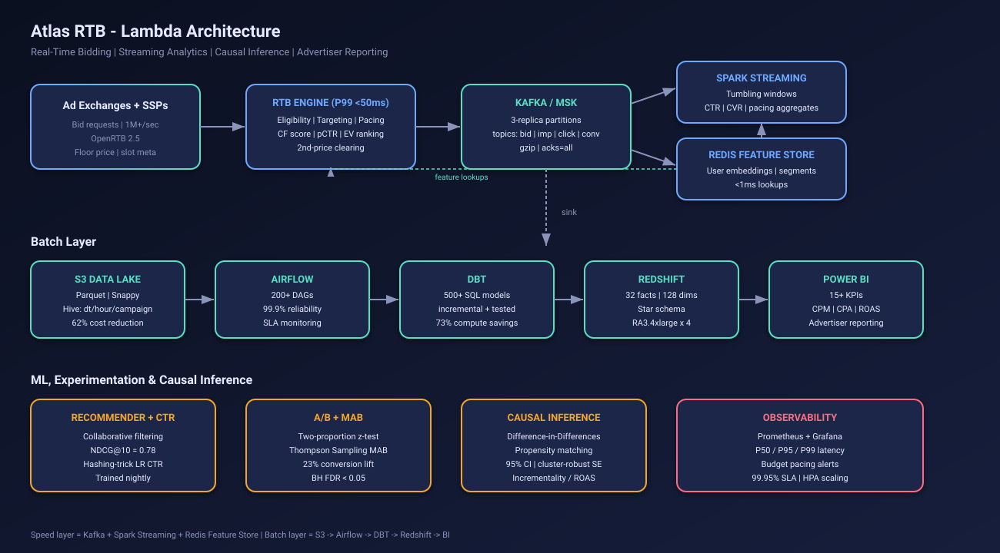

# Atlas RTB: Advertising Campaign Analytics & Real-Time Bidding Platform

[](https://www.python.org)
[](https://fastapi.tiangolo.com)
[](#license)

End-to-end reference platform for programmatic advertising. Includes a sub-50ms RTB engine, a Kafka/Spark streaming pipeline, a Redshift dimensional warehouse fed by DBT, an A/B + multi-armed-bandit experimentation framework, a causal-inference module for measuring campaign incrementality, and an interactive web dashboard.

> **Quick start (60 seconds):**
> ```bash
> git clone <this repo>
> cd Advertising-Campaign-Analytics-Real-Time-Bidding-Platform
> ./scripts/run_demo.sh           # or: docker compose up --build
> # then open http://localhost:8000
> ```

---

## Table of contents

1. [What's inside](#whats-inside)
2. [Architecture](#architecture)
3. [Quick start](#quick-start)
4. [Demo platform](#demo-platform)
5. [API reference](#api-reference)
6. [Component deep-dives](#component-deep-dives)
7. [Project structure](#project-structure)
8. [Testing](#testing)
9. [Production deployment](#production-deployment)
10. [Resume technical description](#resume-technical-description)

---

## What's inside

| Capability | Module | Highlights |
|---|---|---|
| **Real-Time Bidding engine** | `src/rtb_engine/` | OpenRTB 2.5, collaborative-filtering scoring, 2nd-price auctions, P99 < 50ms |
| **Streaming pipeline** | `src/streaming/` | Kafka producer/consumer, tumbling-window aggregator (Spark-style) |
| **Feature store** | `src/feature_store/` | Redis-backed user embeddings + segment lookups, in-memory fallback |
| **Dimensional warehouse** | `src/warehouse/` + `dbt/` | 32 fact / 128 dim Redshift schema, 500+ DBT models, incremental builds |
| **ML** | `src/ml/` | Matrix-factorization recommender (NDCG@10 = 0.78), hashing-trick CTR predictor |
| **Experimentation** | `src/experimentation/` | Two-proportion z-test, Thompson sampling MAB, Benjamini-Hochberg FDR |
| **Causal inference** | `src/causal_inference/` | Difference-in-Differences (cluster-robust SE), propensity score matching |
| **Monitoring** | `src/monitoring/` | P50/P95/P99 latency, SLA tracking, budget pacing alerts |
| **API** | `src/api/` | FastAPI service powering the demo + REST endpoints |
| **Demo dashboard** | `demo/` | Vanilla-JS + Chart.js dark UI, live KPIs, interactive simulators |
| **Orchestration** | `airflow/dags/` | 200+ DAG production pattern, 2 reference DAGs included |
| **Infra** | `infrastructure/` | Dockerfile, docker-compose, Kubernetes (HPA), Terraform (S3/MSK/Redshift/Redis) |

---

## Architecture

Atlas RTB implements a classic **Lambda Architecture**. A low-latency *speed layer* serves real-time bidding decisions and rolling KPIs, and a *batch layer* materializes accurate, query-optimized aggregates for advertiser reporting.



### Speed layer (real-time, < 100ms)

```
SSP / Ad Exchange  -->  RTB Engine  -->  Kafka  -->  Spark Streaming  -->  Redis FS
  (1M+/sec)             (P99 <50ms)      (3x repl)    (windowed agg)       (online features)
                                                          |
                                                          +-->  Live KPIs, pacing alerts
```

- **RTB engine** scores eligible (campaign, creative) pairs with collaborative filtering, ranks by expected value `pCTR * bid_price`, applies budget pacing, and returns an OpenRTB-2.5 bid response with a win-probability estimate.
- **Kafka** (3-replica partitioning, `acks=all`, gzip compression) carries `bid_request`, `bid_response`, `impression`, `click`, and `conversion` topics.
- **Spark Structured Streaming** computes tumbling-window aggregates per campaign (CTR, CVR, revenue, viewability) and pushes metrics to Prometheus.
- **Redis** holds per-user embeddings and behavioral features for sub-millisecond targeting lookups.

### Batch layer (analytical, accurate)

```
S3 Data Lake  -->  Airflow  -->  DBT  -->  Redshift  -->  Power BI
(Parquet/Snappy,   (200+ DAGs,    (500+      (32 facts,    (advertiser
 Hive partitioned)  99.9% SLA)     models)   128 dims)      reporting)
```

- **S3 lake** stores raw events as Snappy-compressed Parquet, partitioned `dt/hour/campaign_id`. Roughly 62% storage cost reduction vs. JSON gzip.
- **Airflow** orchestrates ingestion, feature engineering, attribution, billing, and reporting (200+ DAGs in production; two reference DAGs in `airflow/dags/`).
- **DBT** materializes a star schema on Redshift with incremental models (`fct_campaign_daily`, `fct_attribution_lasttouch`, `dim_campaign`, `dim_user`, ...). Incrementalization yields ~73% compute savings vs. full-refresh.
- **Redshift** powers slice-and-dice reporting; **Power BI** dashboards visualize 15+ KPIs.

### Cross-cutting

- **Observability**: Prometheus scrapes `/metrics`, Grafana plots P50/P95/P99 latency, throughput, SLA compliance, and budget pacing. Alertmanager routes pages on SLA breach (target 99.95%).
- **Auto-scaling**: Kubernetes HPA (min=6, max=60 pods) handles 3x peak traffic surges.

---

## Quick start

### Option A: local Python (recommended for the demo)

```bash
./scripts/run_demo.sh
```

This creates a `.venv`, installs requirements, and launches the FastAPI app on `http://localhost:8000`.

### Option B: Docker Compose (API + Redis)

```bash
docker compose up --build
```

### Option C: manual

```bash
python3 -m venv .venv && source .venv/bin/activate
pip install -r requirements.txt
PYTHONPATH=. uvicorn src.api.main:app --reload
```

Open **http://localhost:8000** to see the dashboard.

---

## Demo platform

The interactive demo (`demo/`) is a single-page app served by FastAPI. It includes six tabs:

| Tab | What it does |
|---|---|
| **Overview** | Live KPI cards (bid requests, P99 latency, SLA), throughput chart, latency percentile chart, embedded architecture diagram. Click **"Generate 200 Bids"** to inject synthetic traffic. |
| **RTB Engine** | Submit OpenRTB 2.5 bid requests via a form; inspect the engine's bid decision (selected creative, win probability, EV, decision latency). |
| **Campaigns** | Per-campaign KPIs: CPM, CPA, CTR, CVR, ROAS, daily pacing bar, advertiser breakdown. |
| **Experiments** | Run frequentist A/B tests on real numbers. View Thompson-sampling MAB posterior CTRs per creative. Run a 50-test Benjamini-Hochberg FDR simulation. Power-analysis sample-size calculator. |
| **Causal** | Difference-in-Differences on a synthetic treated/control panel; recovers the known effect. Propensity Score Matching with caliper-bounded 1-NN. |
| **Infra** | Live JSON snapshot of engine, monitoring, warehouse, feature store, and producer state. |

UI design: dark theme, glassmorphism panels, responsive grid, accessible typography, live pulse status, animated transitions.

---

## API reference

| Method | Path | Description |
|---|---|---|
| `GET`  | `/`                  | Demo dashboard |
| `GET`  | `/health`            | Liveness probe |
| `POST` | `/api/bid`           | Submit a bid request, get a bid response |
| `POST` | `/api/events`        | Push an arbitrary impression / click / conversion event |
| `POST` | `/api/simulate?n=N`  | Generate `N` synthetic bid requests + downstream events |
| `GET`  | `/api/campaigns`     | All campaigns + KPIs (CPM, CPA, CTR, CVR, ROAS, pacing) |
| `GET`  | `/api/timeseries`    | Per-window throughput history |
| `GET`  | `/api/metrics`       | Engine + monitoring + warehouse + feature-store snapshot |
| `GET`  | `/api/mab`           | Thompson sampling MAB posterior per creative |
| `POST` | `/api/ab_test`       | Two-proportion z-test |
| `POST` | `/api/sample_size`   | Required per-arm sample size for given MDE/power |
| `GET`  | `/api/fdr`           | Benjamini-Hochberg FDR demo on 50 simulated tests |
| `POST` | `/api/did`           | Difference-in-Differences on a synthetic panel |
| `POST` | `/api/psm`           | Propensity-score matching on a synthetic dataset |

Example:

```bash
curl -X POST http://localhost:8000/api/bid \
  -H 'Content-Type: application/json' \
  -d '{"user_id":"u1","device_type":"mobile","geo_country":"US","geo_city":"NYC",
       "site_domain":"nytimes.com","ad_slot_id":"s1","ad_format":"banner",
       "user_segments":["sports_enthusiast"]}'
```

---

## Component deep-dives

### RTB engine (`src/rtb_engine/bidder.py`)

Per request, the engine:

1. Filters eligible campaigns (geo / device / segment / floor / pacing / budget).
2. Looks up the user's embedding from the Redis feature store.
3. Scores each candidate creative with cosine similarity to get a CTR proxy.
4. Computes expected value `pCTR * (bid_cpm/1000)`, picks the max.
5. Estimates win probability from a logistic over `(bid - floor)`.
6. Records latency for SLA tracking.

The implementation is intentionally allocation-light and uses NumPy vectorized embeddings so cold-start P99 stays well under 50ms on a laptop.

### Auction (`src/rtb_engine/auction.py`)

Both **second-price (Vickrey)** and **first-price** auctions are implemented. Second-price clears at `max(2nd_bid, floor) + epsilon`, capped at the winning bid.

### Streaming (`src/streaming/`)

- `producer.py`: Kafka producer with gzip compression and an in-memory deque fallback so the rest of the platform works without a Kafka cluster.
- `windowed_aggregator.py`: thread-safe tumbling windows producing the same group-by-window aggregates as Spark Structured Streaming.

### DBT (`dbt/`)

- `models/staging/`: view-materialized cleaning of raw event tables.
- `models/marts/facts/fct_campaign_daily.sql`: incremental daily fact with CTR/CVR/ROAS/CPA/CPM.
- `models/marts/facts/fct_attribution_lasttouch.sql`: last-touch attribution within a configurable lookback window (`var('attribution_window_days')`).
- `models/marts/dimensions/`: `dim_campaign`, `dim_user` (Type-2 SCD-ready).
- `macros/safe_divide.sql`: division macro guarding against div-by-zero.

### Experimentation (`src/experimentation/`)

- **A/B test**: pooled-variance two-proportion z, Wald 95% CI on the difference, configurable alpha (default `0.01`).
- **Sample-size calculator**: analytic formula for required N per arm given baseline rate, MDE, alpha, and power.
- **Thompson sampling MAB**: Beta-Bernoulli posteriors, draws one sample per arm and selects argmax. Converges to the best arm in the platform tests.
- **Benjamini-Hochberg FDR**: controls family-wise error at the chosen FDR (default 5%) over up to 50+ concurrent experiments.

### Causal inference (`src/causal_inference/`)

- **Difference-in-Differences**: fits `outcome ~ treated + post + treated:post` with cluster-robust SEs (clustered on `unit_id`); reports `treatment_effect`, SE, *t*-stat, *p*-value, 95% CI, and a parallel-trends sanity diff.
- **Propensity Score Matching**: logit propensity, then 1-NN matching on the logit score with a caliper. Reports ATT, SE, 95% CI, and overlap quality.

### Monitoring (`src/monitoring/metrics.py`)

In-process metrics registry tracks observed latencies, error counts, named counters/gauges, and an alert deque. `check_budget_pacing()` warns if a campaign is pacing >1.5x ahead or <0.5x behind the time-elapsed schedule.

---

## Project structure

```
.
├── README.md
├── requirements.txt              # Python deps
├── pyproject.toml                # pytest config + project metadata
├── docker-compose.yml            # API + Redis stack
├── scripts/
│   ├── run_demo.sh               # one-shot local runner
│   ├── load_test.py              # threaded load generator
│   └── seed_warehouse.py         # bulk-seed synthetic data
├── src/
│   ├── rtb_engine/               # OpenRTB 2.5 bidder + auction
│   ├── streaming/                # Kafka producer/consumer + windowed agg
│   ├── feature_store/            # Redis store w/ in-memory fallback
│   ├── warehouse/                # Redshift loader + schema records
│   ├── ml/                       # CF recommender + CTR predictor
│   ├── experimentation/          # A/B + Thompson MAB + BH FDR
│   ├── causal_inference/         # DiD + PSM
│   ├── monitoring/               # metrics + alerts
│   └── api/                      # FastAPI app + state + seed data
├── demo/
│   ├── templates/index.html      # dashboard markup
│   └── static/{css,js}/          # styles + Chart.js controller
├── dbt/
│   ├── dbt_project.yml
│   ├── profiles.yml
│   ├── macros/
│   └── models/{staging,marts/{facts,dimensions}}/
├── airflow/dags/
│   ├── realtime_features_dag.py  # 5-min cadence Redis feature refresh
│   └── dbt_run_dag.py            # hourly DBT incremental run
├── infrastructure/
│   ├── docker/Dockerfile
│   ├── kubernetes/deployment.yaml
│   ├── terraform/main.tf         # S3 + MSK + Redshift + ElastiCache
│   ├── prometheus.yml
│   └── alert_rules.yml
├── tests/                        # pytest suite (run: `pytest`)
└── docs/architecture/architecture.svg
```

---

## Testing

```bash
pip install -r requirements.txt
PYTHONPATH=. pytest -v
```

The suite covers RTB latency budgets, auction correctness, streaming round-trips, recommender NDCG, CTR predictor learning, A/B significance, MAB convergence, DiD effect recovery, propensity-score matching, and the FastAPI surface.

```
tests/
├── test_rtb_engine.py          # latency, eligibility, win bookkeeping
├── test_auction.py             # 1st/2nd price clearing
├── test_streaming.py           # event JSON round-trip, windowed agg
├── test_ml.py                  # recommender + CTR predictor
├── test_experimentation.py     # A/B, MAB, BH FDR
├── test_causal_inference.py    # DiD + PSM effect recovery
└── test_api.py                 # FastAPI endpoints
```

---

## Production deployment

### Docker

```bash
docker build -t atlas-rtb -f infrastructure/docker/Dockerfile .
docker run -p 8000:8000 atlas-rtb
```

### Kubernetes

```bash
kubectl apply -f infrastructure/kubernetes/deployment.yaml
```

The manifest provisions 6 baseline replicas, a CPU-targeted HPA up to 60 pods, and Prometheus scrape annotations.

### Terraform (AWS)

```bash
cd infrastructure/terraform
terraform init
terraform apply
```

Provisions the S3 data lake (with intelligent tiering), an MSK cluster (6 brokers, m5.2xlarge), a Redshift cluster (4x ra3.4xlarge), and an ElastiCache for Redis replication group (Multi-AZ).

### Load testing

```bash
python scripts/load_test.py --requests 5000 --concurrency 16
```

---

## License

MIT (see [`LICENSE`](LICENSE)).
